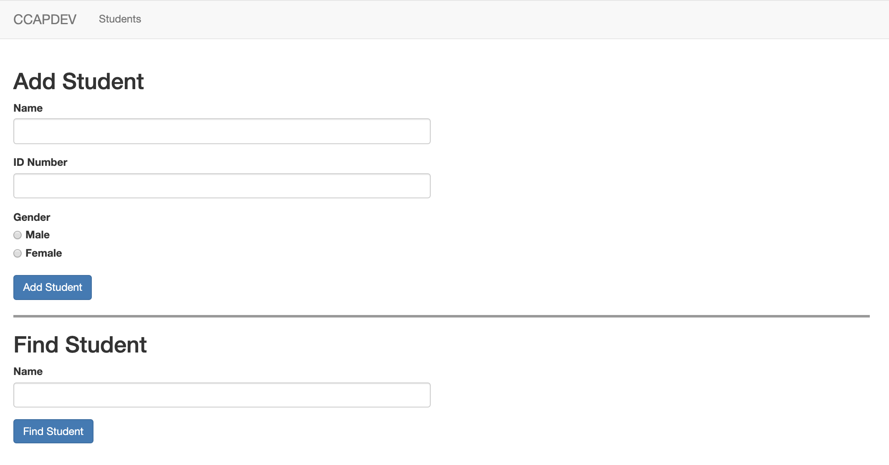

# NodeJS MongoDB Starter Code
This is the starter code for the lecture on MongoDB for CCAPDEV, AY2019-2020, Term 2. It builds on the pre-existing code from the [node-ajax-sample](https://github.com/unisse-courses/node-ajax-starter) with some modifications and additions.

## Learning Objectives
At the end of this sample, you should be able to:
1. Connect this application to your local MongoDB server
2. Perform CRUD operations with MongoDB

## Requirements
* [NodeJS & npm](https://www.npmjs.com/get-npm)
* [MongoDB Community Edition](https://docs.mongodb.com/manual/administration/install-community/)
* Any text editor for JavaScript, HTML & CSS (VSCode, Atom, SublimeText, etc.)

## MongoDB Installation
1. Download MongoDB Community Server from [here](https://www.mongodb.com/download-center/community).
2. Follow the instructions for your operating system from [this guide](https://docs.mongodb.com/manual/administration/install-community/).
3. You can also follow along this [YouTube Video by Traversy Media](https://youtu.be/-56x56UppqQ) for installing and using mongo `shell` & MongoDB Compass (similar to MySQL Workbench).
4. Make sure that mongodb is running as a service in the background. Otherwise, this will not work.

## Local Setup
1. Clone this repository: `git clone https://github.com/unisse-courses/node-mongodb-sample.git`
2. Navigate to the directory: `cd node-mongodb-sample`
3. Install the dependencies: `npm install`
    * I've already installed mongodb so it's in the `package.json` file already.
4. Run the server: `node index.js`
    * Navigate to `http://localhost:9090/` in the browser to view the app.

The landing page should look like this:

Navigate to "Students" on the nav bar and the page should look like this:

To stop the server, simply key in `CTRL+C` (Windows) or `control (^) + C` (Mac).

##### Note: This repository will only allow you to clone and pull the code provided here. To be able to **push changes**, you need to **fork** this repository to your account and that will allow you to keep a personal copy of any changes you may have.

## What to do next
After cloning this repository, read the `TODO.md` file and follow the instructions to be able to complete the code. 🤓
